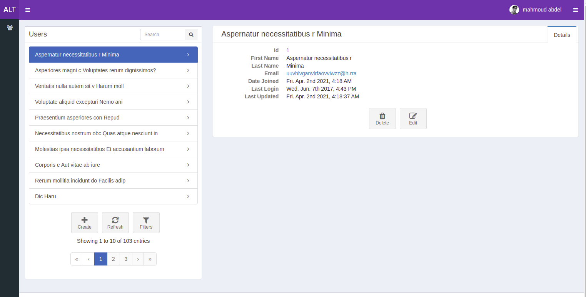

# A Django & React Template
A collection of Django and React modules that will help bootstrap your next Django web
application.

## Installation
```
export project_name={{ project_name }}
mkvirtualenv $project_name
```
1. Follow [backend/README.md](backend/README.md)
1. Follow [frontend/README.md](frontend/README.md)

## TODO
1. Build production configs

## Screenshot


